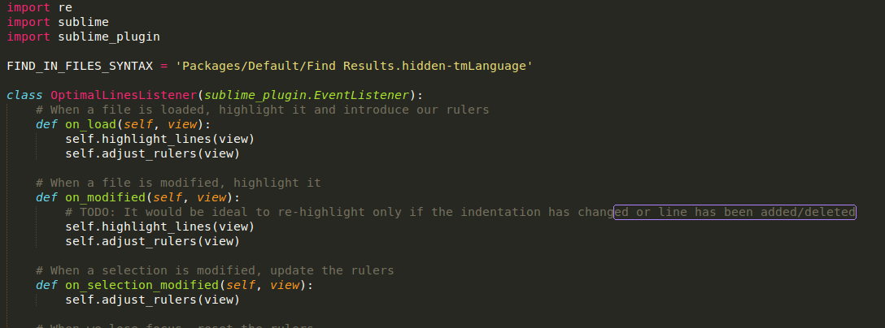

# sublime-optimal-lines

Tools for relative line length limits

This is an experiment between design and code. In typography, there is
a notion of the [ideal amount of characters for a line][chars-per-line]
which enables maximum readability.

[chars-per-line]: http://www.pearsonified.com/2012/01/characters-per-line.php

I wanted to take this concept and apply it to code. Assuming that
whitespace cannot be considered part of the line, we arrive at a need
for relative line length tools. `sublime-optimal-lines` fills this gap:



## Getting Started
`sublime-optimal-lines` can be installed via via the following command
in the Sublime Text terminal (``ctrl+` ``) which utilizes `git clone`.

```python
import os; path=sublime.packages_path(); (os.makedirs(path) if not os.path.exists(path) else None); window.run_command('exec', {'cmd': ['git', 'clone', 'https://github.com/twolfson/sublime-hooks', 'hooks'], 'working_dir': path})
```

Packages can be uninstalled via "Package Control: Remove Package" via
the command pallete, `ctrl+shift+p` on Windows/Linux,`command+shift+p`
on Mac.

## Documentation
_(Coming soon)_

## Examples
_(Coming soon)_

## Donating
Support this project and [others by twolfson][gittip] via [gittip][].

[![Support via Gittip][gittip-badge]][gittip]

[gittip-badge]: https://rawgithub.com/twolfson/gittip-badge/master/dist/gittip.png
[gittip]: https://www.gittip.com/twolfson/

## Contributing
In lieu of a formal styleguide, take care to maintain the existing coding
style. Add unit tests for any new or changed functionality. Lint via
[grunt](https://github.com/gruntjs/grunt) and test via `npm test`.

## License
Copyright (c) 2013 Todd Wolfson

Licensed under the MIT license.
